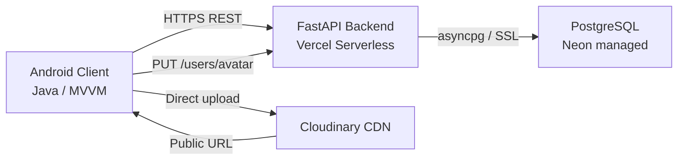

KERN follows a three-tier client-server architecture: an Android application talks exclusively to a FastAPI REST backend deployed on Vercel, which reads and writes to a managed PostgreSQL instance provided by Neon. External services — Cloudinary for avatar storage — are called from the Android client and their results are posted back to the API as URLs.

## System overview



The Android app never communicates directly with the database. All persistence goes through the REST API, which validates inputs with Pydantic, enforces authentication with JWT, and handles database operations through SQLAlchemy's `AsyncSession`.

## Backend

The backend is a single FastAPI application (`app.py`) that runs as a serverless function on Vercel. It uses SQLAlchemy 1.4+ with `AsyncSession` for non-blocking database access via the `asyncpg` driver, and Pydantic models for strict input validation at every endpoint boundary.

**Authentication** is handled with `OAuth2PasswordBearer`. Protected routes declare `Depends(get_current_active_user)`, which decodes the incoming JWT (signed with HS256), looks up the user in the database, and rejects inactive accounts before the handler runs.

**Password security**: Passwords are hashed with SHA-256 via Python's `hashlib` before being written to `users.hashed_password`. Plaintext passwords are never stored.

**Startup initialisation**: On startup, `create_db_and_tables_sync()` in `database.py` runs a synchronous `Base.metadata.create_all(checkfirst=True)` call. This creates any missing tables automatically on first deploy, so no manual migration step is required.

<AccordionGroup>
  <Accordion title="Exercise catalogue loading">
    At startup the API loads two JSON files into memory — `exercises_gym_id.json` and `exercises_home_id.json` — as lists of validated `Exercise` Pydantic objects. Keeping these in memory avoids repeated disk reads during routine generation and the `GET /exercises/gym` endpoint. The `generate_routine_exercises()` function iterates over `ROUTINE_CONFIGS` entries and searches these in-memory lists for matching `primary_muscle` and `movement_pattern` values.
  </Accordion>
  <Accordion title="Routine generation logic">
    When `POST /users/complete-quiz` is called with a valid `assigned_routine` value, the backend:

    1. Updates `users.has_completed_quiz` to `true` and stores the routine name.
    2. Reads `exercises_gym_id.json` from disk.
    3. Calls `generate_routine_exercises(routine_type, all_exercises)`, which iterates over the `ROUTINE_CONFIGS` list for that type and finds one matching exercise per entry — first by exact `primary_muscle + movement_pattern` match, then by muscle-only fallback, then by random selection among candidates.
    4. Creates one `Routine` row and one `RoutineExercise` row per selected exercise, each pre-loaded with three default series at `{"numSerie": 1-3, "kilos": 0, "reps": 10}`.
  </Accordion>
  <Accordion title="Historical progression lookup">
    `GET /routines/{routine_id}` queries `workout_sessions` for the most recent session matching the routine name (case-insensitive via `.ilike()`). It then searches `data_json` for each exercise by normalised name match, builds a `historial_map` keyed by `numSerie`, and annotates each series with `prev_kilos`, `prev_reps`, and `anterior`. The series returned to the client always have `kilos: 0` and `reps: 0` so Android treats `prev_*` fields as suggestions rather than defaults.
  </Accordion>
</AccordionGroup>

## Android client

The Android application is written in Java and follows the MVVM pattern with a clear package-level separation of concerns.

```
app/src/main/java/
├── ui/
│   ├── fragments/         # Screen-level UI (WorkoutActiveFragment, HomeFragment, etc.)
│   ├── adapter/           # RecyclerView adapters (ActiveExerciseAdapter)
│   └── login/             # Registration and login screens
├── viewmodel/             # ViewModels exposing LiveData to fragments
├── data/
│   ├── repository/        # RoutineRepository, UserRepository — single source of truth
│   └── remote/
│       └── ApiService     # Retrofit interface defining all API calls
└── services/
    └── StepCounterService # Foreground service for TYPE_STEP_COUNTER sensor
```

**Repository pattern**: `RoutineRepository` and `UserRepository` wrap all Retrofit calls. Fragments never interact with the network directly — they observe `LiveData` exposed by a ViewModel, which delegates to the repository. This also makes it straightforward to add a Room database layer for offline support in the future.

**Step counting**: `StepCounterService` runs as a foreground service with a persistent notification to prevent Android from killing the process during a long workout. It registers a `TYPE_STEP_COUNTER` sensor listener and persists a step-count offset to `SharedPreferences` so the session count survives accidental app closure.

**Volume calculation**: `WorkoutActiveFragment` maintains a running total of `kilos × reps` for every series marked as complete. This value is submitted as `total_volume` in the `POST /workouts/finish` payload.

## Database schema

All four tables are created by SQLAlchemy's `Base.metadata.create_all()` using the models defined in `models.py`.

### `users`

| Column | Type | Notes |
|---|---|---|
| `id` | `INTEGER` PK | Auto-increment |
| `username` | `VARCHAR(128)` | Unique, indexed |
| `email` | `VARCHAR(255)` | Unique, indexed |
| `hashed_password` | `VARCHAR(256)` | SHA-256 hex digest |
| `full_name` | `VARCHAR(100)` | Nullable |
| `phone` | `VARCHAR(50)` | Nullable |
| `avatar_url` | `VARCHAR(255)` | Nullable; Cloudinary URL |
| `role` | `VARCHAR(50)` | Default `"user"` |
| `bio` | `VARCHAR(500)` | Nullable |
| `has_completed_quiz` | `BOOLEAN` | Default `false` |
| `assigned_routine` | `VARCHAR(100)` | Nullable; set by `/users/complete-quiz` |
| `disabled` | `BOOLEAN` | Default `false`; blocks auth if `true` |
| `created_at` | `TIMESTAMPTZ` | Server default `now()` |

### `routines`

| Column | Type | Notes |
|---|---|---|
| `id` | `INTEGER` PK | Auto-increment |
| `user_id` | `INTEGER` FK → `users.id` | Non-nullable |
| `name` | `VARCHAR(255)` | e.g. `"Mi Rutina Full Body Inicial"` |
| `created_at` | `TIMESTAMPTZ` | Server default `now()` |

### `routine_exercises`

| Column | Type | Notes |
|---|---|---|
| `id` | `INTEGER` PK | Auto-increment |
| `routine_id` | `INTEGER` FK → `routines.id` | Non-nullable; cascade delete |
| `exercise_name` | `VARCHAR(255)` | Matched against JSON catalogue at runtime |
| `series` | `JSON` | Array of `{"numSerie": int, "kilos": float, "reps": int}` |

### `workout_sessions`

| Column | Type | Notes |
|---|---|---|
| `id` | `INTEGER` PK | Auto-increment |
| `user_id` | `INTEGER` FK → `users.id` | Non-nullable |
| `routine_name` | `VARCHAR(255)` | Used for ilike-match in historical lookup |
| `duration_seconds` | `INTEGER` | Total session duration |
| `total_volume` | `FLOAT` | Sum of `kilos × reps` across all sets |
| `steps` | `INTEGER` | Default `0`; from `StepCounterService` |
| `data_json` | `JSON` | Full exercise + series snapshot; source for `prev_kilos`/`prev_reps` |
| `created_at` | `TIMESTAMPTZ` | Server default `now()` |

## External integrations

<CardGroup cols={2}>
  <Card title="Cloudinary" icon="image">
    Avatar images are uploaded from Android directly to Cloudinary using the Cloudinary Android SDK (`MediaManager`). On success, Cloudinary returns a public HTTPS URL which the app sends to `PUT /users/avatar`. The API stores this URL in `users.avatar_url`; no binary data passes through the FastAPI backend.
  </Card>
  <Card title="Neon (PostgreSQL)" icon="database">
    Neon provides a serverless PostgreSQL instance. The backend connects via `asyncpg` with SSL. The `DATABASE_URL` environment variable is read at startup; the `database.py` module strips SSL query parameters from the URL and passes an SSL context object directly to the engine for compatibility with asyncpg.
  </Card>
  <Card title="Vercel" icon="cloud">
    The FastAPI app is deployed as a Vercel serverless function. The `on_startup` event handler runs `create_db_and_tables_sync()` on cold start, ensuring tables exist before any request is handled. The API is publicly accessible over HTTPS with CORS enabled for all origins.
  </Card>
  <Card title="MPAndroidChart" icon="chart-line">
    The dashboard uses MPAndroidChart to render a line chart of `total_volume` values from `GET /users/my-history`, giving users a visual record of load progression over time.
  </Card>
</CardGroup>
